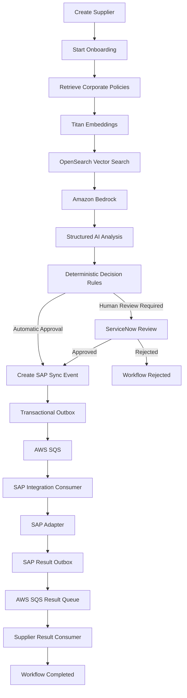
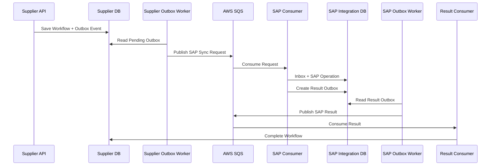
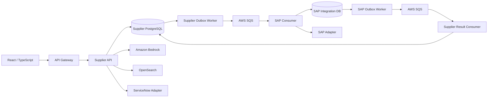

# Supplier Master AI

> **AI-assisted Supplier Master onboarding using RAG, Amazon Bedrock, OpenSearch, Human-in-the-Loop workflows, event-driven architecture and SAP integration.**

Supplier Master AI is a reference implementation of a modern enterprise Supplier Master onboarding platform.

The system demonstrates how Generative AI can assist complex business workflows while preserving deterministic business rules, auditability, resiliency and human control.

Instead of allowing an LLM to directly execute enterprise actions, the platform combines:

```text
Enterprise Policies
        ↓
       RAG
        ↓
AI Recommendation
        ↓
Deterministic Rules
        ↓
Decision
   ┌────┴─────┐
   ↓          ↓
Automatic   Human
Workflow    Review
   │          │
   └────┬─────┘
        ↓
       SAP
```

---

## Business Problem

Supplier onboarding in large organizations commonly involves multiple systems and manual verification steps.

A typical process may require validating supplier information, checking onboarding policies, identifying missing documents, evaluating compliance risks, requesting human approval and finally synchronizing the supplier with an ERP such as SAP.

These workflows tend to become slow and difficult to automate because business policies are frequently expressed as documents rather than executable rules.

Supplier Master AI explores how **RAG and Generative AI can assist this decision process without replacing deterministic workflow controls**.

The AI does not directly create suppliers in SAP.

Instead, it produces a structured recommendation that is evaluated by application rules before the workflow is allowed to continue.

---

## End-to-End Workflow



---

## AI Decision Pipeline

The AI workflow is intentionally constrained.

```text
Supplier
    ↓
Build Retrieval Query
    ↓
Titan Embeddings
    ↓
OpenSearch
    ↓
Relevant Corporate Policies
    ↓
Bedrock LLM
    ↓
Structured Analysis
    ↓
Deterministic Validation
```

The LLM returns a structured response such as:

```json
{
  "risk_level": "medium",
  "recommended_action": "human_review",
  "confidence": 0.87,
  "missing_documents": [],
  "policy_violations": [],
  "summary": "Supplier requires additional validation."
}
```

The application then applies deterministic rules.

For example:

```text
confidence < threshold
        ↓
HUMAN REVIEW

missing documents
        ↓
HUMAN REVIEW

high risk
        ↓
HUMAN REVIEW
```

This prevents an LLM response from independently authorizing a critical enterprise operation.

---

## Retrieval-Augmented Generation

Corporate supplier policies can be ingested directly from the application.

```text
Policy Document
      ↓
Chunking
      ↓
Titan Embeddings
      ↓
OpenSearch
      ↓
Vector Index
```

During supplier analysis:

```text
Supplier Context
      ↓
Embedding
      ↓
Semantic Search
      ↓
Relevant Policy Chunks
      ↓
Bedrock Prompt Context
```

The frontend includes a **Policy Ingest** interface for adding or updating policies without running maintenance scripts manually.

---

## Human-in-the-Loop

Not every AI recommendation should be executed automatically.

When the confidence level or risk profile requires human intervention, the workflow moves to:

```text
WAITING_HUMAN_REVIEW
```

The current implementation includes a ServiceNow integration boundary and a fake adapter for local demonstrations.

A reviewer can:

```text
APPROVE
   ↓
Continue SAP synchronization

REJECT
   ↓
Stop onboarding
```

This pattern allows AI to assist the workflow while keeping business-critical decisions auditable and controllable.

---

## Event-Driven Architecture

SAP synchronization is asynchronous.



---

## Reliability Patterns

The project uses enterprise messaging patterns to deal with failures and at-least-once message delivery.

| Pattern | Purpose |
|---|---|
| Transactional Outbox | Prevents losing integration events after database commits |
| Inbox | Tracks consumed messages |
| Idempotent Consumers | Protect against duplicate SQS deliveries |
| Correlation ID | Follows a business workflow across services |
| Message ID | Identifies one integration event |
| Retry / DLQ | Handles transient and poison-message failures |
| Unit of Work | Coordinates transactional persistence |
| Explicit Integration Events | Decouples bounded contexts |

---

## Bounded Contexts

The system intentionally separates Supplier Management from SAP Integration.

### Supplier Context

Owns:

```text
supplier_db
```

Used by:

```text
api-supplier
worker-supplier-outbox
consumer-supplier-sap-result
```

Responsibilities include supplier lifecycle, AI analysis, onboarding workflow and outbound SAP synchronization requests.

### SAP Integration Context

Owns:

```text
sap_integration_db
```

Used by:

```text
consumer-sap
worker-sap-outbox
```

Responsibilities include idempotent SAP request processing, ERP integration and publishing SAP synchronization results.

**The Supplier context never directly accesses the SAP Integration database.**

---

## Deployables

```text
backend/
├── api-gateway/
├── api-supplier/
├── worker-supplier-outbox/
├── consumer-sap/
├── worker-sap-outbox/
└── consumer-supplier-sap-result/

frontend/
└── React + TypeScript
```

---

## Architecture



---

## API Gateway

The frontend communicates exclusively with the API Gateway.

```text
Frontend
   ↓
API Gateway :8000
   ↓
Supplier API :8001
```

The gateway is responsible for edge concerns such as correlation IDs, CORS, downstream timeouts, health checks and HTTP proxying.

Main routes include:

```text
GET  /api/v1/suppliers
POST /api/v1/suppliers

GET  /api/v1/suppliers/{supplier_id}

POST /api/v1/suppliers/{supplier_id}/analysis

GET  /api/v1/suppliers/{supplier_id}/onboarding
POST /api/v1/suppliers/{supplier_id}/onboarding

POST /api/v1/suppliers/{supplier_id}/onboarding/review-decision

POST /api/v1/policies/ingest
```

---

## Observability

Observability is implemented as a cross-cutting concern across all backend services.

The platform uses:

```text
OpenTelemetry
Structured JSON Logging
Correlation IDs
Trace IDs
Span IDs
Jaeger
```

The Supplier AI pipeline exposes spans similar to:

```text
POST /analysis
│
└── AnalyzeSupplier
    │
    ├── PostgreSQL
    │
    ├── Policy Retrieval
    │   ├── Titan Embedding
    │   └── OpenSearch
    │
    └── Bedrock Analysis
```

Structured logs include contextual fields such as:

```text
service
correlation_id
trace_id
span_id
supplier_id
workflow_id
message_id
event_type
component
duration_ms
```

Prompts, AWS credentials and sensitive policy contents are intentionally excluded from logs.

---

## Distributed Tracing and Messaging

HTTP trace context is automatically propagated between the API Gateway and downstream services.

SQS producers also propagate W3C trace context using message attributes:

```text
traceparent
tracestate
baggage
```

Business operations additionally use:

```text
correlation_id
```

to correlate the complete onboarding workflow independently of individual technical traces.

---

## Technology Stack

| Area | Technology |
|---|---|
| Backend | Python 3.11, FastAPI |
| Frontend | React, TypeScript, Vite |
| AI | Amazon Bedrock |
| LLM | GPT-OSS through Bedrock |
| Embeddings | Amazon Titan Embeddings |
| RAG | OpenSearch Vector Search |
| Database | PostgreSQL |
| Messaging | AWS SQS |
| Persistence | SQLAlchemy |
| Architecture | DDD, CQRS / Vertical Slice |
| Messaging patterns | Outbox, Inbox, Idempotency |
| Observability | OpenTelemetry, Jaeger |
| Containers | Docker, Docker Compose |
| ERP integration | SAP Adapter Boundary |
| Human Workflow | ServiceNow Adapter Boundary |

---

## Running with Docker

Create your local Docker environment configuration:

```powershell
Copy-Item .env.docker.example .env.docker
```

Configure your AWS profile and SQS queue URLs, then run:

```powershell
docker compose up --build
```

Services are available at:

| Component | URL |
|---|---|
| Frontend | `http://localhost:5173` |
| API Gateway | `http://localhost:8000` |
| Supplier API Swagger | `http://localhost:8001/docs` |
| Jaeger | `http://localhost:16686` |
| PostgreSQL | `localhost:5432` |

---

## Local Development

For development, the recommended setup is:

```text
Docker
├── PostgreSQL
├── OpenTelemetry Collector
└── Jaeger

VS Code
├── API Gateway
├── Supplier API
├── Workers
└── Consumers

Vite
└── React frontend
```

Start infrastructure:

```powershell
docker compose up -d postgres jaeger otel-collector
```

The repository includes VS Code launch configurations for debugging the backend services with breakpoints.

---

## Testing

The backend contains automated tests across all deployables covering application handlers, gateway behavior, messaging mapping, AI integration boundaries and workflow processing.

The architecture is designed so external systems such as SAP and ServiceNow can be replaced by fake adapters during tests.

---

## Current Integration Boundaries

This repository intentionally uses:

```text
FakeSapGateway
FakeServiceNowGateway
```

for local execution.

They implement the same application boundaries that production adapters would use.

A production implementation could replace them with:

```text
SAP OData / BAPI Adapter
ServiceNow REST Adapter
```

without changing the core application workflow.

---

## Design Decisions

### Why not let the LLM execute SAP operations directly?

Because LLM output is probabilistic.

The LLM provides a recommendation; deterministic application rules decide whether the workflow may proceed.

### Why RAG instead of placing policies directly in the prompt?

Enterprise policies change independently from application releases.

RAG allows the system to retrieve the most relevant policy fragments dynamically.

### Why asynchronous SAP integration?

ERP integrations can be slow or temporarily unavailable.

SQS combined with Outbox/Inbox and idempotency decouples Supplier Management from SAP availability.

### Why separate Supplier and SAP databases?

The contexts represent different business responsibilities.

Database ownership reinforces service boundaries and prevents accidental coupling.

### Why both `trace_id` and `correlation_id`?

A trace represents a technical execution path.

A correlation ID represents the long-running business workflow, which may span multiple traces and asynchronous operations.

---

## Production Hardening

The repository demonstrates the architecture and main runtime workflow.

A production deployment would additionally introduce:

```text
Real SAP adapter
Real ServiceNow adapter
OIDC/JWT authentication
RBAC
Secrets Manager
IAM least privilege
Infrastructure as Code
CI/CD
Automated end-to-end tests
DLQ terminal failure processor
Production monitoring and alerting
```

---

## What This Project Demonstrates

This repository is intended to demonstrate more than an AI API call.

It combines:

```text
Generative AI
+
RAG
+
Responsible AI
+
Human-in-the-Loop
+
DDD
+
Event-Driven Architecture
+
Reliable Messaging
+
Enterprise Integration
+
Distributed Observability
```

The central architectural principle is:

> **AI recommends. Deterministic software decides. Enterprise workflows remain auditable.**
