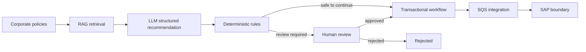
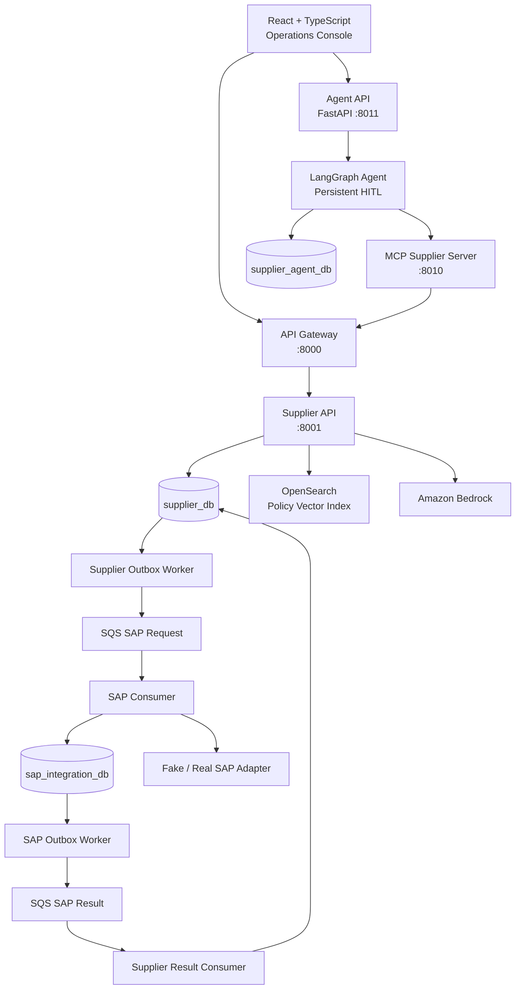
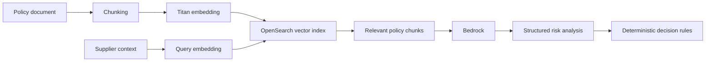

# Supplier Master AI

> Governed enterprise supplier onboarding with RAG, Amazon Bedrock, LangGraph, MCP, Human-in-the-Loop controls, event-driven integration and SAP boundaries.

Supplier Master AI is a reference implementation for **AI-assisted Supplier Master onboarding**. The central architectural idea is simple: AI may interpret policy context and recommend an action, but **deterministic application logic remains the authority for business transitions and integration side effects**.

The project combines a React operations console, Python/FastAPI services, PostgreSQL, OpenSearch vector retrieval, Amazon Bedrock, LangGraph, MCP, AWS SQS, Transactional Outbox/Inbox patterns, OpenTelemetry and a replaceable SAP integration adapter.

## Why this project exists

Supplier onboarding in large organizations often requires policy interpretation, master-data validation, risk analysis, human approval and ERP synchronization. These steps are difficult to automate safely when policy knowledge lives in documents and downstream systems are not always available.

The design therefore separates probabilistic AI from deterministic business authority:



**The LLM does not directly write to SAP or the Supplier database.**

## Architecture at a glance



## Main capabilities

- Supplier master-data creation and query.
- Policy ingestion from text/Markdown into OpenSearch.
- Titan embeddings and semantic policy retrieval.
- Bedrock-based structured supplier analysis.
- Deterministic onboarding workflow transitions.
- Business Human-in-the-Loop review for risky/uncertain cases.
- Stateful LangGraph AI Agent with PostgreSQL checkpoints.
- Agent Human-in-the-Loop approval before state-changing tools.
- MCP capability boundary between the Agent and business APIs.
- Durable onboarding idempotency.
- Transactional Outbox/Inbox and idempotent SQS consumers.
- Separate Supplier and SAP Integration database ownership.
- Correlation IDs, structured logs and OpenTelemetry traces.
- Fake ServiceNow and SAP adapters that preserve production integration boundaries.

## Deployables

| Deployable | Responsibility |
|---|---|
| `frontend` | React operations console, supplier screens, policy ingest and Agent UI |
| `api-gateway` | Public `/api` edge, CORS, correlation propagation and downstream errors |
| `api-supplier` | Supplier domain, policy RAG, AI analysis and onboarding workflow |
| `mcp-supplier` | MCP tools/resources over the public business API boundary |
| `agent-supplier` | LangGraph orchestration, model selection, checkpoints, HITL and Agent API |
| `worker-supplier-outbox` | Publishes Supplier integration events to SQS |
| `consumer-sap` | Idempotently consumes SAP synchronization requests |
| `worker-sap-outbox` | Publishes SAP integration results to SQS |
| `consumer-supplier-sap-result` | Applies SAP results to the Supplier workflow |

## AI governance model

The platform deliberately uses two distinct Human-in-the-Loop mechanisms.

### Business review

The Supplier onboarding workflow can enter `waiting_human_review` when confidence is low, documents are missing or risk is high. Approval or rejection changes persisted business workflow state.

### Agent tool approval

When the LangGraph Agent proposes a state-changing MCP tool, `HumanInTheLoopMiddleware` interrupts the Agent execution and persists the pending action in PostgreSQL. The tool runs only after an explicit approve decision.

These mechanisms solve different problems: one governs the **business process** and the other governs **agent execution**.

## RAG and decision pipeline



The AI output is structured and includes fields such as risk level, recommended action, confidence, missing documents and policy violations. Application rules decide whether the workflow can continue automatically.

## Agent boundary

The Agent does not receive database credentials or repositories. Its path is:

```text
User → Agent API → LangGraph → MCP → API Gateway → Supplier API → Domain/Persistence
```

Technical reliability arguments are also kept outside the model. For example, the LLM sees `start_supplier_onboarding(supplier_id)` while the runtime generates the idempotency key.

## Event-driven SAP synchronization

SAP synchronization is asynchronous and uses separate request/result flows:

```text
supplier_db
  ↓ Transactional Outbox
Supplier Outbox Worker
  ↓
SQS request queue
  ↓
SAP Consumer
  ↓ Inbox + SAP operation + result Outbox
sap_integration_db
  ↓
SAP Outbox Worker
  ↓
SQS result queue
  ↓
Supplier Result Consumer
  ↓
supplier_db
```

The system assumes at-least-once message delivery. Inbox tracking, message IDs and idempotent application behavior protect against duplicate deliveries.

## Database ownership

| Database | Owner / use |
|---|---|
| `supplier_db` | Supplier API, Supplier Outbox Worker, Supplier SAP Result Consumer |
| `sap_integration_db` | SAP Consumer, SAP Outbox Worker |
| `supplier_agent_db` | LangGraph checkpoint/runtime state only |

Database bootstrap is consolidated in **`database/init.sql`**. The script creates the three databases and aligns the Supplier/SAP schemas. LangGraph creates its checkpoint tables at Agent startup through `AsyncPostgresSaver.setup()`.

## Local development

See [README-RUN-LOCAL.md](README-RUN-LOCAL.md) for the complete procedure.

Core services are started with Docker Compose. The current repository runs MCP and the Agent API as local Python processes so the React Agent UI can reach `localhost:8011` and the Agent can reach MCP on `localhost:8010`.

Important local endpoints:

| Component | URL |
|---|---|
| Frontend | `http://localhost:5173` |
| API Gateway | `http://localhost:8000` |
| Supplier API / Swagger | `http://localhost:8001/docs` |
| MCP | `http://localhost:8010/mcp` |
| Agent API | `http://localhost:8011` |
| Jaeger | `http://localhost:16686` |
| PostgreSQL | `localhost:5432` |

## Validation status

The current backend test suites for Gateway, Supplier API, messaging consumers and Outbox workers were executed together using pytest importlib mode:

```text
56 passed
```

The repository currently has no equivalent automated test suite for `agent-supplier` or `mcp-supplier`; those components should be treated as an explicit next hardening area rather than implied test coverage.

## Production hardening still required

This is a portfolio/reference architecture, not a production-ready Supplier Master product. A production deployment should additionally include:

- OIDC/JWT authentication and capability-level authorization;
- least-privilege IAM and managed secret storage;
- immutable audit records for business and Agent approvals;
- rate limits, quotas and abuse controls;
- production migration tooling and backup/restore procedures;
- Agent/MCP automated tests and evaluation suites;
- model/prompt/version governance and AI quality evaluation;
- production SAP and ServiceNow adapters;
- queue alarms, DLQ operations and replay procedures;
- cost, latency and model-quality monitoring.

## Documentation

- [Business Overview](docs/BUSINESS_OVERVIEW.md)
- [Technical Architecture](docs/TECHNICAL_ARCHITECTURE.md)
- [Agent API and Web UI](docs/AGENT_API_AND_UI.md)
- [Microservices Messaging](docs/microservices-messaging.md)
- [Run Messaging Flow](docs/RUN_MESSAGING_FLOW.md)
- [Observability](OBSERVABILITY.md)
- [Local Runtime Guide](README-RUN-LOCAL.md)
- [Database Bootstrap](database/README.md)
- [Onboarding Idempotency](backend/IDEMPOTENCY-IMPLEMENTATION.md)
- [API Gateway](backend/api-gateway/README.md)
- [ADR 001 — Governed deterministic workflow](docs/decisions/001-determinisc-workflow-with-ai.md)
- [ADR 002 — Unit of Work boundary](docs/decisions/002-unit-of-work-persistence-boundary.md)

## Repository safety

Real `.env` files are intentionally excluded by `.gitignore`. Commit only example configuration files and placeholders. Never publish local archives containing real environment files or credentials.
