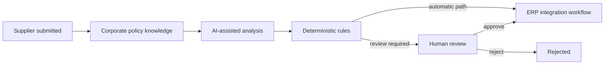
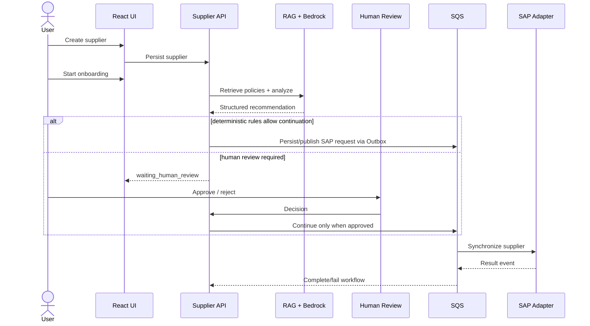

# Supplier Master AI — Business Overview

## Executive summary

Supplier Master AI demonstrates how an enterprise can accelerate supplier onboarding with Generative AI while preserving **human control, deterministic business rules, auditability and resilient ERP integration**.

The objective is not to let an LLM become a system-of-record authority. AI is used to interpret policy context and produce a structured recommendation; application rules and human governance decide whether a critical workflow may continue.

## Business problem

Large-company supplier onboarding often spans procurement, compliance, finance and ERP operations. Common challenges include:

- policies stored in documents rather than executable rules;
- repetitive manual interpretation of supplier data and policy requirements;
- incomplete or suspicious information that needs contextual review;
- inconsistent reviewer decisions;
- fragile synchronous ERP calls;
- duplicate processing after retries/timeouts;
- poor visibility across long-running workflows;
- difficulty explaining why a supplier was approved, rejected or escalated.

## Business capabilities

### Supplier master-data operations

Operators can create, list and inspect supplier master data from the React operations console.

### Policy knowledge-base management

Operators can ingest text/Markdown supplier policies. The backend chunks the content, creates Titan embeddings and indexes policy chunks in OpenSearch.

### AI-assisted supplier analysis

The Supplier API retrieves relevant policy context and asks the configured Bedrock model for a structured risk analysis. AI output is decision support, not final authorization.

### Governed onboarding

The persisted onboarding workflow applies deterministic conditions around AI confidence, missing documents and risk. The workflow can proceed or enter `waiting_human_review`.

### Business Human-in-the-Loop

A reviewer can approve or reject an onboarding that requires review. Approval resumes the deterministic workflow; rejection terminates it with a reason.

### Supplier AI Agent

The Agent provides a natural-language investigation/operations interface. It can query Supplier facts, request RAG analysis, inspect onboarding state and propose available state changes through MCP capabilities.

State-changing Agent tool requests are separately protected by LangGraph Human-in-the-Loop approval.

### Comprehensive investigation

The Agent's read-only `investigate_supplier` capability combines three authoritative views:

1. supplier master data;
2. AI/RAG analysis;
3. persisted onboarding workflow state.

If one source fails, the Agent must report it as unavailable. If facts conflict, the system prompt requires the Agent to surface the inconsistency instead of inventing a resolution.

### Resilient SAP integration

Approved workflows synchronize asynchronously through SQS and Transactional Outbox/Inbox patterns. This decouples supplier processing from temporary SAP availability and protects against duplicate deliveries.

## Two different approval problems

Supplier Master AI deliberately distinguishes:

- **Business review:** Is this supplier allowed to proceed?
- **Agent execution approval:** Is this AI-proposed state-changing tool allowed to run?

They are not the same approval and are persisted/handled by different parts of the architecture.

## Personas

| Persona | Primary goal | Main interface |
|---|---|---|
| Supplier Operations Analyst | Create and inspect supplier records | Supplier UI |
| Compliance / Reviewer | Review risk evidence and decide | Supplier UI / Agent approval |
| Procurement Operations | Understand onboarding progress | Supplier UI / Agent |
| AI / Platform Engineer | Govern models, RAG and Agent behavior | Configuration / backend |
| Integration Engineer | Operate ERP synchronization | Queues, workers, traces |

## End-to-end business journey

## Governance principles

- **RAG grounds context; it does not authorize transactions.**
- **LLM interprets and recommends; it does not own workflow transitions.**
- **Application/domain rules enforce invariants.**
- **Human review controls business exceptions.**
- **LangGraph HITL controls Agent-triggered write operations.**
- **MCP exposes capabilities, not database access.**
- **Idempotency protects retries and duplicate intentions.**
- **Outbox/Inbox protect asynchronous integration consistency.**
- **Correlation IDs make long-running flows traceable.**

## What the project demonstrates

The repository is a reference architecture for using AI in a controlled enterprise workflow. It shows how AI, distributed systems and traditional domain/application boundaries can work together without making an LLM the transaction authority.

It intentionally uses fake SAP and ServiceNow adapters for local demonstration while preserving the integration seams required for real implementations.
