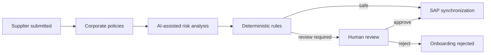
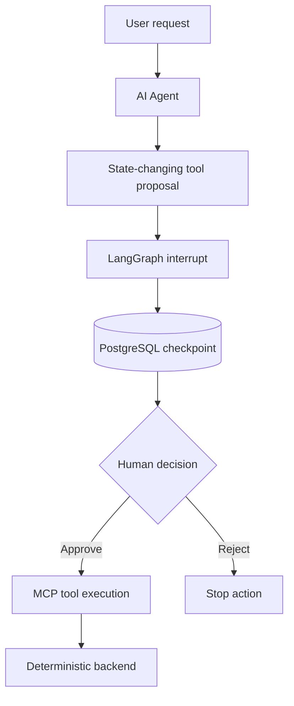
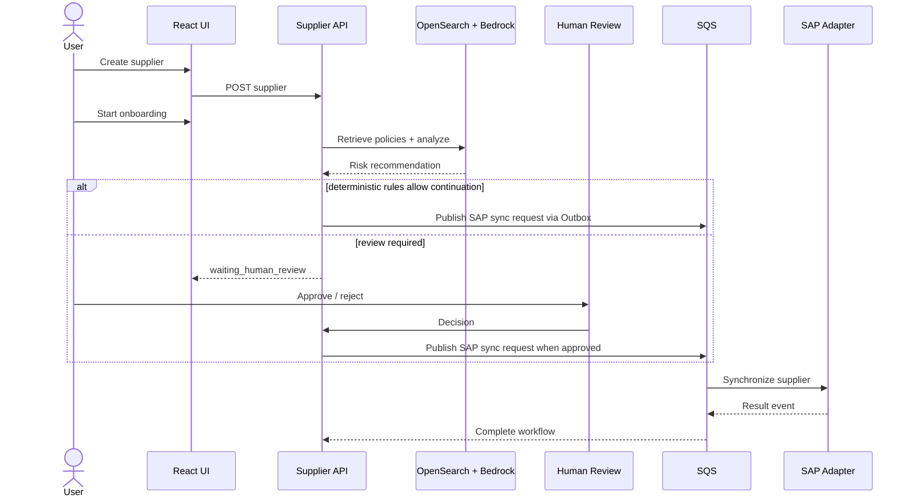

# Supplier Master AI — Business Overview

## Executive summary

Supplier Master AI is a reference implementation of an enterprise supplier-onboarding platform that combines **Generative AI, Retrieval-Augmented Generation (RAG), Human-in-the-Loop governance, deterministic workflow rules, event-driven integration and SAP synchronization**.

The business objective is not to replace supplier governance with an LLM. The objective is to reduce manual analysis while keeping critical decisions **controlled, explainable, auditable and recoverable**.

## Business problem

Supplier onboarding in large companies commonly spans procurement, compliance, finance, ERP teams and external systems. The information required to approve a supplier is often distributed across master data and policy documents, while the final ERP action must remain deterministic and auditable.

Typical pain points include:

- manual interpretation of onboarding and compliance policies;
- slow review of incomplete or suspicious supplier data;
- inconsistent decisions between reviewers;
- fragile synchronous integrations with ERP systems;
- duplicate processing during retries;
- poor visibility across long-running onboarding workflows;
- difficulty proving why a supplier was approved, rejected or sent to review.

## Business capabilities

### 1. Supplier master-data management

Operators can create and inspect supplier master data through the React operations console.

### 2. AI-assisted policy analysis

The Supplier API retrieves relevant policy chunks from OpenSearch and asks an LLM to produce a structured risk recommendation. The AI result is decision support, not final authorization.

### 3. Policy knowledge-base management

The existing **Policy Ingest** screen lets an operator provide policy text or load a text/Markdown file. The backend chunks the document, creates Titan embeddings and indexes the policy in OpenSearch for later RAG retrieval.

### 4. Governed onboarding workflow

The platform starts an onboarding workflow and applies deterministic rules around confidence, missing documents and risk. A workflow can continue automatically or move to human review.

### 5. Human review

A reviewer can approve or reject a supplier waiting for review. Human review is available in the existing supplier screen and, for agent-generated write operations, through the new LangGraph Human-in-the-Loop approval experience.

### 6. Supplier AI Agent

The Agent provides a natural-language interface for operations and investigation. It can retrieve supplier facts, run RAG analysis, inspect persisted onboarding state and propose governed actions through MCP tools.

A write operation is never executed simply because the LLM requested it:

### 7. Full supplier investigation

The Agent exposes a dedicated read-only investigation capability that combines three authoritative views:

1. supplier master data;
2. AI/RAG risk assessment;
3. persisted onboarding workflow state.

The Agent must surface inconsistencies rather than invent a resolution. For example, supplier status and onboarding workflow status are intentionally treated as separate concepts.

### 8. SAP integration

Approved workflows are synchronized asynchronously through SQS and transactional Outbox/Inbox patterns. This protects Supplier Management from temporary ERP availability issues.

## Personas

| Persona | Goal | Main interface |
|---|---|---|
| Supplier Operations Analyst | Create and inspect suppliers | Supplier UI |
| Compliance / Reviewer | Review AI findings and approve/reject | Supplier UI / Agent HITL |
| Procurement Operations | Understand onboarding status | Supplier UI / Agent |
| AI / Platform Engineer | Govern models, RAG and agent behavior | Backend / configuration |
| Integration Engineer | Operate SAP synchronization | Workers, queues, tracing |

## End-to-end business journey

## AI governance principles

The project deliberately separates probabilistic AI from business authority.

- **LLM:** interprets context and recommends.
- **RAG:** grounds analysis in indexed policy documents.
- **Application rules:** decide whether automation is allowed.
- **LangGraph HITL:** gates critical agent actions.
- **Backend:** enforces domain invariants and persistence.
- **Idempotency:** protects write operations against duplicate execution.
- **Audit context:** correlation IDs and persisted workflow state make the process traceable.

## Business value demonstrated by the project

This repository demonstrates how an enterprise can use AI without turning an LLM into an unrestricted system-of-record operator. It combines faster analysis with controls expected in real supplier-master, finance, procurement and ERP workflows.
