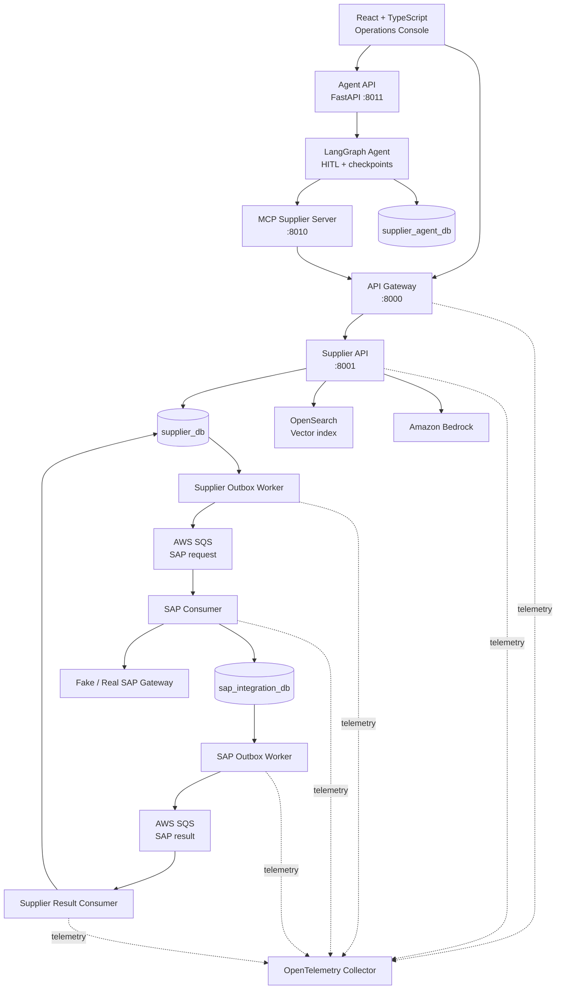
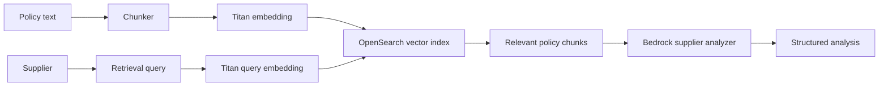
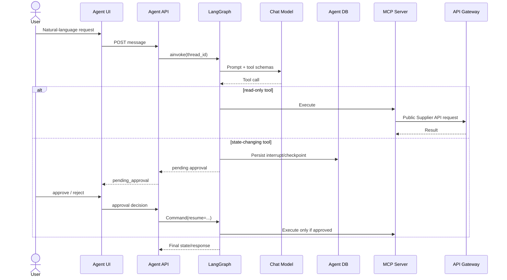

# Supplier Master AI — Technical Architecture

## Architectural objective

Supplier Master AI is designed around one rule: **probabilistic AI may interpret and recommend, but deterministic application code owns business state transitions and side effects**.

The repository is a reference/portfolio architecture, not a production-ready procurement product.

## System context



## Deployables and ownership

| Deployable | Responsibility |
|---|---|
| `frontend` | Supplier operations, policy ingest, onboarding controls, Agent UI |
| `api-gateway` | Edge proxy, CORS, correlation propagation, downstream availability handling |
| `api-supplier` | Supplier domain/application, RAG, AI analysis, onboarding, policy ingestion |
| `mcp-supplier` | AI-facing capability adapter over the public API boundary |
| `agent-supplier` | LLM selection, LangGraph orchestration, checkpoints, HITL, Agent HTTP API |
| `worker-supplier-outbox` | Publish Supplier Outbox events |
| `consumer-sap` | Consume SAP request events, persist operation, call SAP gateway |
| `worker-sap-outbox` | Publish SAP Integration result Outbox events |
| `consumer-supplier-sap-result` | Consume SAP results and update Supplier workflow |

## Bounded contexts and databases

### Supplier bounded context — `supplier_db`

Owned/used by:

- `api-supplier`;
- `worker-supplier-outbox`;
- `consumer-supplier-sap-result`.

Primary persisted concepts:

- suppliers;
- supplier onboarding workflows;
- Supplier Outbox messages;
- Supplier Inbox/processed result messages.

### SAP Integration bounded context — `sap_integration_db`

Owned/used by:

- `consumer-sap`;
- `worker-sap-outbox`.

Primary persisted concepts:

- request Inbox messages;
- SAP synchronization operations;
- SAP result Outbox messages.

### Agent runtime — `supplier_agent_db`

Used by LangGraph PostgreSQL checkpoints. This is infrastructure/runtime state and is intentionally separate from Supplier domain persistence.

LangGraph owns its checkpoint tables and creates them through `AsyncPostgresSaver.setup()`.

## Database bootstrap

Local/reference database setup is consolidated in:

```text
database/init.sql
```

The script can initialize fresh databases and align older local schemas with current required columns/indexes, including onboarding idempotency. Production deployments should use controlled migrations.

## Supplier application architecture

`api-supplier` follows a feature-oriented application structure with domain entities, protocols/repositories, handlers and infrastructure adapters.

Typical write path:

```text
FastAPI endpoint
  ↓
Command / request model
  ↓
Application handler/service
  ↓
Domain entity transitions
  ↓
Unit of Work + repositories
  ↓
PostgreSQL
```

Infrastructure concerns such as SQLAlchemy, Bedrock, OpenSearch and ServiceNow adapters are kept outside domain entities.

## RAG pipeline



### Policy ingestion

The Policy Ingest feature accepts policy metadata/content, chunks the document, creates embeddings and indexes policy chunks.

### Supplier analysis

Supplier context is embedded/searched against the policy index. Retrieved policy chunks ground the Bedrock prompt. The analyzer returns a structured result instead of free-form authorization.

## Governed onboarding workflow

The workflow persists states such as:

```text
pending
  ↓
analyzing
  ├─→ waiting_human_review ─→ syncing_to_sap
  ├─→ syncing_to_sap
  ├─→ rejected
  └─→ failed
              ↓
          completed
```

Transitions are methods on the domain workflow entity and are checked before state changes.

### Deterministic decision boundary

The AI result may include confidence, risk, missing documents and a recommendation. Application logic determines whether human review is required. This prevents a model response from directly authorizing SAP synchronization.

## Durable onboarding idempotency

`SupplierOnboardingWorkflow` persists an `idempotency_key`.

Database protections include:

- unique idempotency key;
- partial unique index preventing more than one active (non-failed/non-rejected) onboarding workflow per supplier.

For Agent-originated onboarding, the model does not see this technical argument; the Agent runtime generates it.

## Agent architecture



### Source-of-truth rules

The Agent system prompt explicitly requires:

- tool results as source of truth;
- Supplier status and onboarding workflow status treated as separate concepts;
- inconsistencies surfaced instead of guessed away;
- no claim of execution without tool confirmation;
- no automatic retry of failed state-changing tools.

### Composite investigation

`investigate_supplier` concurrently calls:

- `get_supplier`;
- `analyze_supplier`;
- `get_onboarding_status`.

Each source is normalized independently so one failed source can be reported as unavailable without fabricating data.

## MCP boundary

MCP exposes business capabilities and resources, not persistence internals.

Read-oriented MCP tools include supplier queries, analysis and onboarding status. State-changing tools include onboarding start, review decisions and policy ingestion.

Human approval is enforced by the Agent runtime, while backend APIs remain responsible for domain invariants and idempotency.

## Model-provider routing

`agent-supplier` selects a chat provider using `AGENT_AI_PROVIDER`:

- `bedrock` (default);
- `openai` (optional dependency/configuration);
- `gemini` (optional dependency/configuration).

Provider modules are loaded lazily so the default Bedrock installation does not require OpenAI/Gemini packages.

This provider factory affects the **Agent**. Supplier RAG analysis in `api-supplier` remains on its Bedrock/Titan/OpenSearch path.

## Event-driven SAP integration

The Supplier and SAP Integration contexts communicate through versioned integration events rather than shared repositories/tables.

### Supplier request transaction

```text
workflow -> syncing_to_sap
+ supplier.sap-sync.requested.v1 Outbox message
+ commit
```

No SAP call occurs inside the Supplier transaction.

### SAP processing

The SAP consumer validates the message, protects duplicate processing with Inbox/message identity, persists SAP operation state, calls the SAP gateway and persists a result Outbox event.

### Result processing

The SAP Outbox worker publishes the result queue event. The Supplier result consumer applies completion/failure to the Supplier workflow and tracks processed messages.

## Integration-event contract

The common envelope uses:

```text
message_id
correlation_id
event_type
version
occurred_at
payload
```

JSON Schema contracts under `/contracts` document the language-neutral message shapes.

## Observability

Observability keeps technical and business identities distinct:

- `trace_id` — technical trace;
- `correlation_id` — onboarding business flow;
- `message_id` — integration event;
- `thread_id` — Agent conversation.

Backend services use structured logs and optional OpenTelemetry instrumentation. SQS producer/consumer boundaries can propagate W3C trace context through message attributes.

## Local runtime topology

The current Docker Compose stack starts the core application, workers/consumers, PostgreSQL, frontend and observability stack. MCP and Agent API are launched as local Python processes in the documented local workflow.

This avoids claiming container orchestration that the current repository does not yet provide for the Agent/MCP path.

## Validation

Current automated backend validation covers Gateway, Supplier API, SAP consumer, Supplier result consumer and both Outbox workers:

```text
56 passed
```

Agent/MCP test automation is an explicit next hardening item.

## Security and production hardening

Production should add:

- OIDC/JWT authentication;
- capability/role authorization at Gateway, APIs, Agent and MCP;
- least-privilege IAM and managed secrets;
- immutable audit trail for business and Agent approvals;
- request/model rate limits and quotas;
- prompt/model/version governance and evaluation;
- controlled database migrations and backup/restore;
- real SAP/ServiceNow adapters;
- operational DLQ replay procedures;
- production dashboards/alerts for AI, queues and integrations.
