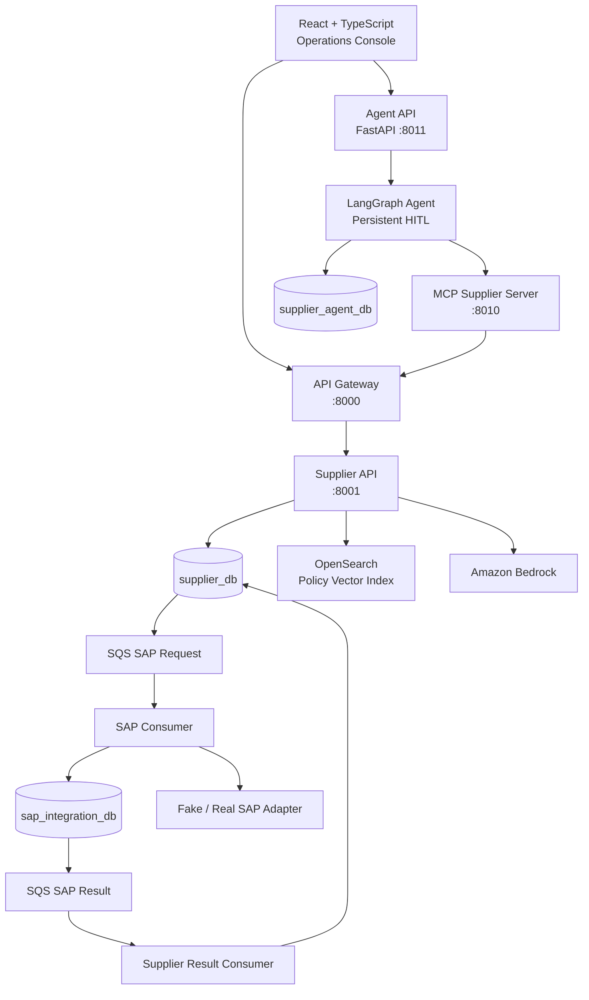
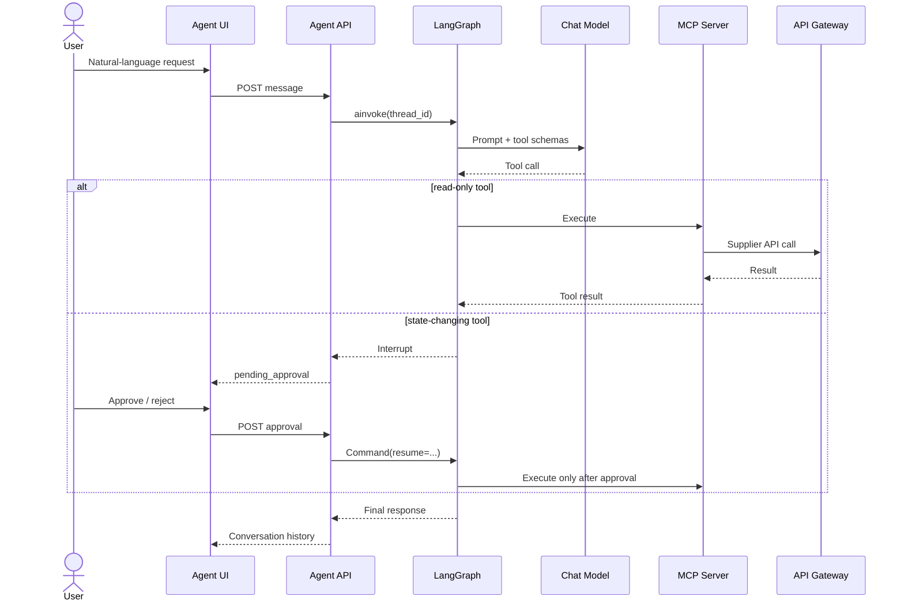
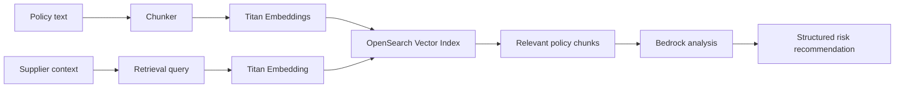

# Supplier Master AI — Technical Architecture

## Architecture at a glance



## Deployables

| Deployable | Responsibility |
|---|---|
| `frontend` | React operations console, policy ingest, supplier details, Agent UI and HITL approvals |
| `api-gateway` | CORS, correlation, downstream proxying, timeout handling |
| `api-supplier` | Supplier domain, RAG analysis, onboarding workflow, policy ingestion |
| `mcp-supplier` | Stable AI capability boundary over Supplier APIs |
| `agent-supplier` | LangChain/LangGraph orchestration, provider selection, checkpoints, HITL, Agent API |
| `worker-supplier-outbox` | Publishes Supplier integration events |
| `consumer-sap` | Idempotently consumes SAP sync requests |
| `worker-sap-outbox` | Publishes SAP integration results |
| `consumer-supplier-sap-result` | Applies SAP results to Supplier workflow |

## Bounded contexts and database ownership

### Supplier bounded context

Owns `supplier_db`.

Used by:

- `api-supplier`;
- `worker-supplier-outbox`;
- `consumer-supplier-sap-result`.

### SAP Integration bounded context

Owns `sap_integration_db`.

Used by:

- `consumer-sap`;
- `worker-sap-outbox`.

### Agent runtime

Owns `supplier_agent_db` for LangGraph checkpoints. Agent state is infrastructure state and is deliberately separated from Supplier domain persistence.

## Agent architecture



### Persistent conversations

Every conversation has a LangGraph `thread_id`. The PostgreSQL checkpointer persists messages and interrupts, allowing a process restart before an approval is completed.

### Technical arguments are not delegated to the LLM

`start_supplier_onboarding` is wrapped before being exposed to the model. The LLM sees only the business argument:

```text
start_supplier_onboarding(supplier_id)
```

The runtime injects a UUID idempotency key only after human approval:

```text
LLM tool request
    ↓
LangGraph HITL
    ↓
Human approve
    ↓
Agent wrapper creates uuid4()
    ↓
MCP start_supplier_onboarding(supplier_id, idempotency_key)
```

## Full investigation capability

The Agent adds a composite read-only `investigate_supplier` tool. It concurrently calls the MCP capabilities for:

- `get_supplier`;
- `analyze_supplier`;
- `get_onboarding_status`.

Each source is returned independently. A failure in one source is represented as unavailable rather than silently fabricated.

## MCP boundary

The MCP server exposes capabilities rather than database access.

### Read tools

- `health`
- `get_supplier`
- `get_suppliers`
- `analyze_supplier`
- `get_onboarding_status`

### State-changing tools

- `start_supplier_onboarding`
- `approve_supplier_review`
- `reject_supplier_review`
- `ingest_supplier_policy`

### Resources

- `supplier://{supplier_id}`
- `supplier-onboarding://{supplier_id}`

### Prompt

- `investigate_supplier(supplier_id)`

Human approval is an Agent/LangGraph policy boundary. MCP tools do not trust an LLM-supplied `confirmed=true` flag.

## Agent API

Base URL in local development: `http://localhost:8011`.

| Method | Endpoint | Purpose |
|---|---|---|
| `GET` | `/health` | Agent API/provider health |
| `POST` | `/api/agent/threads` | Create conversation ID |
| `GET` | `/api/agent/threads/{thread_id}` | Restore history and pending approval |
| `POST` | `/api/agent/threads/{thread_id}/messages` | Send natural-language message |
| `POST` | `/api/agent/threads/{thread_id}/investigate/{supplier_id}` | Run full read-only investigation |
| `POST` | `/api/agent/threads/{thread_id}/approval` | Resume HITL with approve/reject |

Example pending approval response:

```json
{
  "thread_id": "2d73...",
  "status": "pending_approval",
  "message": null,
  "pending_actions": [
    {
      "name": "start_supplier_onboarding",
      "arguments": {
        "supplier_id": "76448e91-427e-4b87-9281-06e27e314a23"
      },
      "description": "Supplier Master action requires human approval"
    }
  ],
  "history": []
}
```

## Model-provider routing

The Agent runtime uses a provider factory selected by `AGENT_AI_PROVIDER`.

Supported selections:

```text
bedrock  ← default and existing working path
openai   ← optional package/config
 gemini  ← optional package/config
```

Bedrock remains the default, so existing `AWS_REGION` and `BEDROCK_MODEL_ID` behavior is preserved.

The Supplier RAG analyzer inside `api-supplier` continues to use Amazon Bedrock and Titan/OpenSearch. Agent provider selection does not change the existing Supplier analysis implementation.

## RAG pipeline



## Event-driven SAP integration

The system uses separate request and result queues with explicit integration-event envelopes. Messages use at-least-once delivery semantics, so consumers are idempotent.

Reliability patterns include:

- Transactional Outbox;
- Inbox / processed-message tracking;
- idempotent consumers;
- unique constraints for business-level duplicate protection;
- message IDs and correlation IDs;
- DLQs;
- trace-context propagation.

## Observability

Cross-cutting observability uses structured logging and OpenTelemetry. Important identities are kept separate:

- `trace_id`: one technical distributed trace;
- `correlation_id`: long-running business workflow;
- `message_id`: one integration event;
- `thread_id`: one Agent conversation/checkpoint stream.

## Security model

This is a portfolio/reference implementation. Production hardening should add OIDC/JWT, authorization on Agent/API/MCP capabilities, least-privilege IAM, secret management, audit storage, request-rate controls and production-grade persistent checkpointer migrations.
